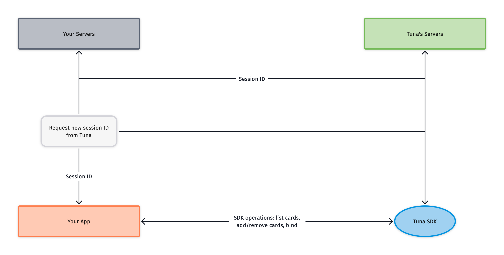

# Tuna iOS SDK

A powerful and flexible SDK for easy payment processing with any iOS, watchOS, macOS, or tvOS app.

This is the reference for the Tuna SDK for Apple's platforms. You will find all details needed to configure and use the TUNA SDKs in your app. 
You can use our iOS SDK to start a payment session, store credit cards, and generate tokens for payment through your backend.

## Getting Started

### Configuration

#### Swift Package Manager

The Tuna SDK is available as a Swift package. You can add it to your Xcode project by going to `File > Swift Packages > Add Package Dependency`.

You may also integrate directly by editing your `Package.swift` file:

```swift
let package = Package(
    ...
    dependencies: [
        .package(url: "https://github.com/tuna-software/ios-sdk.git", from: "0.1.0")
    ],
    ...
)
```

#### CocoaPods

Support for CocoaPods coming soon.

## Usage

### Initialize the SDK

This must be done early in your app's lifecycle, for example, in your app delegate's `application:didFinishLaunchingWithOptions:` callback.
Use of the SDK requires an app token obtained from Tuna.

#### Swift

```swift
import UIKit
import Tuna

@main
class AppDelegate: UIResponder, UIApplicationDelegate {

    func application(_ application: UIApplication, didFinishLaunchingWithOptions launchOptions: [UIApplication.LaunchOptionsKey: Any]?) -> Bool {
        TunaSDK.configure(appToken: "<your Tuna app token>")
        
        // ...
        
        return true
    }
	
	// ...
```

If you wish to operate in the sandbox environment, you may pass in the optional `sandbox` parameter with a value of `true`:

```swift
import UIKit
import Tuna

@main
class AppDelegate: UIResponder, UIApplicationDelegate {

    func application(_ application: UIApplication, didFinishLaunchingWithOptions launchOptions: [UIApplication.LaunchOptionsKey: Any]?) -> Bool {
        TunaSDK.configure(appToken: "your Tuna app token", sandbox: true)
        
        // ...
        
        return true
    }
	
	// ...
```

#### Objective-C

```objc
@import Tuna;

@implementation AppDelegate


- (BOOL)application:(UIApplication *)application didFinishLaunchingWithOptions:(NSDictionary *)launchOptions {
    [TunaSDK configureWithAppToken:@"your Tuna app token" sandbox:YES];
    
    return YES;
}
```

### Tuna session

Every interaction with the Tuna APIs happens within a session. You must provide a session ID obtained from Tuna in order to initialize the SDK. For security reasons, this session ID must be negotiated between your own server and Tuna's servers.

Here's what initializing a session looks like:

- Your app sends a request to your own backend
- Your backend talks to Tuna's servers, to generate a new session ID for the customer
- Tuna's servers send the newly generated session ID to your own backend
- Your backend responds to your app with the new session ID
- Your app calls the Tuna SDK in order to set the current session ID



Starting the session doesn't have to be done on app launch. For example, a good place to start the session would be when the customer enters your checkout flow.

#### Swift

```swift
import Tuna

// ...

func startTunaSession() {
    // Method that calls your API service.
    MyAPI.generateSessionID(...) { result in
        switch result {
        case .success(let newSessionID):
            // Set the new session ID on TunaSDK after obtaining it from your servers.
            TunaSDK.sessionID = newSessionID
        case .failure(let error):
            // ...
        }
    }
}
```      

#### Objective-C

```objc
- (void)startTunaSession
{
	[MyAPI generateSessionIDWithCompletionHandler:^(NSString *sessionID, NSError *error){
		if (error) {
			// handle error
			return;
		}
		
		[TunaSDK setSessionID:sessionID];
	}];
}
```

### Adding a new card

In order to add a new card to the user's account, use the `addNewCard` method.
It takes the credit card information: number, holder name, expiration month and year, the CVV (optional) and a `save` parameter.
If the `save` parameter is true, the card will be saved and retrieved in the future when the same user logs in. If not, it can only be used within the current session.

The CVV parameter should be used when creating a card that is going to be used immediately. 
If the card is going to be used only at a later date, you can save it without the CVV, then use `bind` later to get a usable token.

#### Swift

```swift
TunaSDK.addNewCard(
    number: "card number goes here",
    cardHolderName: "cardholder name goes here",
    expirationMonth: "expiration month, int from 1 to 12",
    expirationYear: "expiration year, two digits",
	cvv: "the card's CVV (optional, only if it's going to be used immediately)",
    save: saveSwitch.isOn
) { [weak self] result in
    switch result {
    case .success(let newCard):
        // All good
    case .failure(let error):
        // Something went wrong
    }
}
```


#### Objective-C

```objc
[TunaSDK addNewCardWithNumber:@"card number goes here"
               cardHolderName:@"cardholder name goes here"
              expirationMonth:1 // expiration month, int from 1 to 12
               expirationYear:21 // expiration year, two digits
                          cvv:nil
                         save:YES
                   completion:^(TunaCard *newCard, TunaSDKError *error)
{
    if (error) {
        // Something went wrong
    } else {
        // All good
    }
}];

```

### Binding a saved card with CVV

#### Swift

```swift
TunaSDK.bindCard(card, cvv: "card CVV input by the user goes here") { result in
    switch result {
    case .success(let bindedCard):
        // Ready to make money
    case .failure(let error):
        // Something went wrong
    }
}
```

#### Objective-C

```objc
[TunaSDK bindCard:card cvv:@"card CVV input by the user goes here" completion:^(TunaCard *card, TunaSDKError *error) {
    if (error) {
        // Something went wrong
    } else {
        // Ready to make money
    }
}];
```